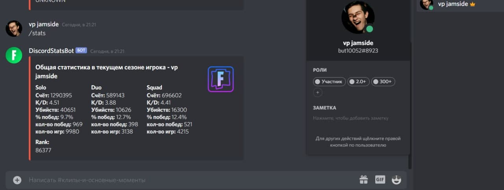

# DiscordBot-v2.0
The user of the discord server sends a text that contains the command, and the player's nickname, then the DiscordStatsBot sends a request to the api, receives data in json format, processes the data and sends a message to the discord server in the form of a table with the received data of the found player.

## Technologies 
Spring Boot, Gson, Jsoup, JDA (Java Discord API), Lombok.

### The logic for adding roles to the user
Also, the bot adds / changes roles to the user who sent the message "/ stats" (! Without a nickname after the command).
Examples:
1. If the player has a kill / death rate of 2.72 and a rank of 244, then the bot will add the following roles to him: 2.0+ (2.72> 2), 300 (150 <244 <300).
2. If the player has a kill / death rate of 0.3 and there is no rank, then the bot will add the following role to him: 0 - 0.5 (0.3 <0.5).
3. If the player has a kill / death rate of 1.17 and a rank of 5 244, then the bot will add the following roles to him: 1.0 - 1.5 (1.0 <1.17 <1.5), 300+ (300 <5 244).
## Screenshots

Sending the table to the chat and adding roles to the user.

The player has no pvp statistics, and the player was not found.

Sending the table to the chat, while the bot does not add roles to the user.